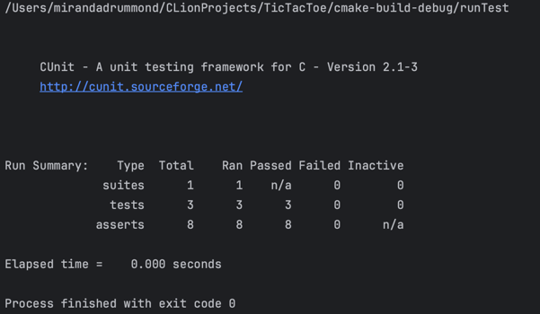
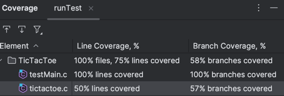
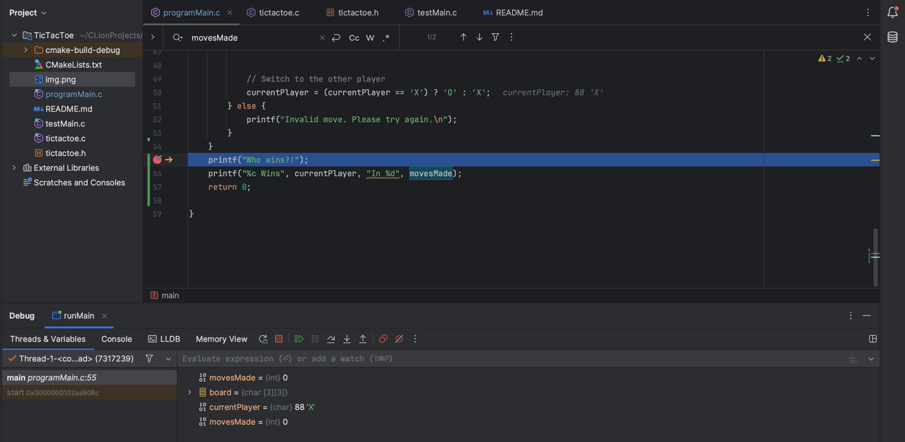
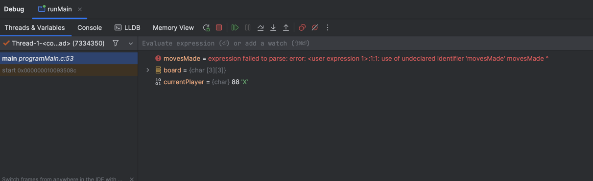
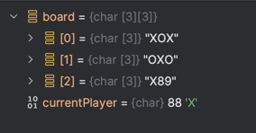

# TicTacToe
## Key Info
### A simple command line TicTacToe game using the C programming language.

This code is designed to work in CLion, if you copy and paste the files and compile them via the command line they should still work.

In this repo we have the following files:

`tictactoe.c` - Contains all the functions which run the tic tac toe game.
`tictactoe.h` - The header file which exports the functions from the `.c` file so they can be used in our other files.
`programMain.c` - The file we run when we want to just run the program. This takes the functions from `tictactoe.c` and then uses them in its main function.
`testMain.c` - This file takes the functions from `tictactoe.c` and runs unit tests on them using the CUnit library.

This file format allows us to effectively have two main programs, one for testing and one for running our game.

Here we have the output of our 3 test suites and their subsequent tests:

The testing allowed me to see that I was not properly checking if there was a win every time. Because of these tests, I realised I hadn't updated the `tictactoe.h` file with the correct inputs in one of my functions.

Aditionally, using the coverage funcitonality, I was able to see that a large portion of my tests aren't being covered.

## Output of debugging:

Here we can see the output of when I run my debugger. Here is the output when I was using a variable movesMade.

I ended up deleting the variable, however, because of the memory allocation when I first ran my debugger, the allocation remained but the variable now appears undefined.

Then of course, when we terminate and re-run the debugger, it dissapears.

A quick explanation, because I set my breakpoint right before I terminate the program, we can see what each row in the board is displaying, and the currentPlayer (which is the winner).
